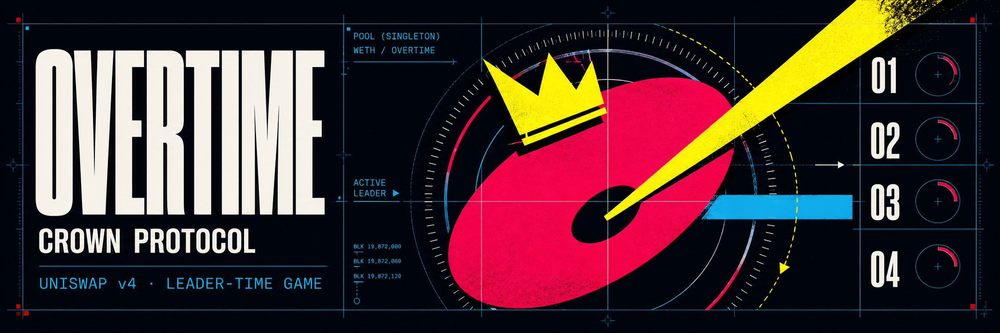

# Overtime Hook

Overtime is a recurring leader-time game on one canonical Uniswap v4 WETH/OVERTIME pool. Every
swap contributes a 1% WETH game fee. Authenticated exact-input WETH challenges take the crown,
extend the soft deadline, and fund champion and crown-time rewards.

`specs.md` is the authoritative economic and security contract. This implementation is unaudited;
local verification is engineering evidence, not permission to deploy.

## Architecture

- `OvertimeHook` owns fee remainders, round state, liabilities, ERC-6909 WETH claims, and payouts.
- `OvertimeChallengeRouter` binds payer, player, output recipient, and refund beneficiary to its caller.
- `OvertimeToken` is a fixed-supply, privilege-free 18-decimal ERC-20.
- `OvertimeLauncher` atomically deploys assets, initializes the pool, and forms locked liquidity.
- `LockedLiquidityVault` permanently owns the single full-range PositionManager NFT.
- `RoundMath` and `HookDataCodec` own pure economic math and the fixed versioned challenge format.

The long-lived launcher delegates creation to launcher-only deployers so every runtime contract fits
Ethereum's EIP-170 limit without weakening atomic rollback.

## Local checks

```sh
bun install --frozen-lockfile
./scripts/check.sh
```

The full gate formats and builds Solidity, reports contract sizes, runs unit/integration/fuzz/stateful
invariant tests, checks devnet cleanup behavior, runs Oxlint and Oxfmt, typechecks TypeScript, and
builds the browser app.

The browser app uses React, Wagmi and Viem for the wallet boundary, TanStack Query for authoritative
chain reads, Zustand for the serialized action state, and StyleX for the visual system. It is one
arena screen, so it does not add a routing dependency.

## Disposable devnet

```sh
./scripts/devnet-check.sh
```

The lifecycle deploys the pinned local v4 stack, atomically launches Overtime, funds 100 disposable
Anvil accounts, approves WETH, submits 100 challenges through the production router, advances the
round clock, finalizes the round, claims the champion and crown-time rewards, verifies categorized
liabilities against hook-owned PoolManager claims, writes `reports/devnet.json`, and shuts down its
owned Anvil process.

Generated deployment state lives in `.devnet/deployment.json`; the UI consumes the same manifest at
`ui/public/deployment.json` while the devnet is running.

## Deployment boundary

No script broadcasts to a public network without the explicit confirmation gate in
`scripts/testnet-deploy.sh`. Never put private keys in environment files, commands, manifests, or
browser source. A production launch additionally requires the pinned Ethereum mainnet fork proof,
security review, static analysis, and an external audit appropriate for a return-delta hook.
